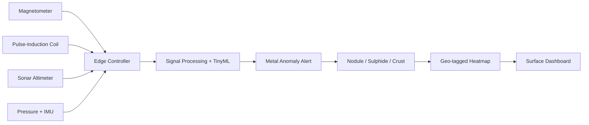

# 🌊 AQUAMAG SCOUT

### Low-Cost Deployable Seafloor Metal Detection Sensor

**Sense • Fuse • Detect • Map • Explore**


---

## 📑 Table of Contents

- [About the Project](#-about-the-project)
- [Problem](#-problem)
- [Project Vision](#-project-vision)
- [Key Features](#-key-features)
- [AI System](#-ai-system)
- [How It Works](#-how-it-works)
- [Tech Stack](#-tech-stack)
- [Project Structure](#-project-structure)
- [Documentation](#-documentation)
- [Roadmap](#-roadmap)

---

## 🌟 About the Project

**AquaMag Scout** is a compact sensor pod that fuses four sensing sources to
find metal-rich spots on the seabed, built to be low-cost and plug-and-play on
any ROV, AUV or lander.

| | Item | Detail |
|---|---|---|
| 🏆 | Event | Smart India Hackathon 2026 |
| 🆔 | Problem Statement | SIH26064 |
| 🏛️ | Ministry | Ministry of Earth Sciences (MoES) |
| 🤖 | Theme / Category | Robotics and Drones / Hardware |
| 👥 | Team | Bug Busters (Team ID 139910) |

---

## ❗ Problem

- 🌑 Dark, deep, remote seabed
- 💸 Costly, heavy survey sensors
- 🐢 Slow and sparse exploration

---

## 🎯 Project Vision

- 💰 **Low Cost** – off-the-shelf parts instead of expensive survey sensors
- 🧲 **Two Sensing Physics Fused** – magnetic + electromagnetic response
- 🧠 **Edge AI** – detection and classification on the sensor itself
- 🔌 **Plug-and-Play** – mounts on ROV / AUV / towfish
- 🗺️ **Geo-tagged Maps** – results as a seabed heatmap

---

## 🚀 Key Features

| Module | What it does |
|---|---|
| 🧲 Magnetometer | Detects magnetic anomalies from metal deposits |
| 📡 Pulse-Induction Coil | Detects conductive metal response |
| 🌊 Sonar Altimeter | Tracks height above seabed |
| 🧭 Pressure + IMU | Depth and orientation for drift correction |
| 🧠 Edge Controller | STM32 / ESP32 + Raspberry Pi |
| 🖥️ Surface Dashboard | Live alerts and geo-tagged heatmap |

---

## 🤖 AI System

A TinyML classifier on the edge controller:

| Stage | Purpose |
|---|---|
| Signal processing | Filtering, drift removal, noise reduction |
| Anomaly detection | Flags readings that differ from the seabed baseline |
| Classification | Nodule / Sulphide / Crust |
| Mapping | Geo-tagged heatmap of detections |

**Safety rule:** the AI only flags and suggests; humans decide where to sample.

---

## ⚙️ How It Works



---

## 🧰 Tech Stack

| Layer | Technology |
|---|---|
| Edge software | Python, Embedded C / C++ |
| ML | TensorFlow Lite |
| Messaging | MQTT |
| Dashboard | React |
| Mapping | QGIS |
| Controllers | STM32 / ESP32, Raspberry Pi |
| Sensors | Fluxgate / MEMS magnetometer, pulse-induction coil, sonar altimeter, pressure sensor + IMU |
| Housing | Pressure-rated housing |

---

## 🗂️ Project Structure

```
AQUAMAG_SCOUT/
├── docs/
│   ├── problem-statement.md
│   ├── solution-overview.md
│   ├── architecture.md
│   ├── hardware-design.md
│   ├── software-and-ai.md
│   ├── prototype-plan.md
│   ├── feasibility-and-risks.md
│   ├── impact.md
│   ├── roadmap.md
│   └── references.md
├── .gitignore
└── README.md
```

---

## 📚 Documentation

| Document | Description |
|---|---|
| [Problem Statement](docs/problem-statement.md) | Challenge and context |
| [Solution Overview](docs/solution-overview.md) | Idea and innovation |
| [Architecture](docs/architecture.md) | System design |
| [Hardware Design](docs/hardware-design.md) | Sensors and housing |
| [Software & AI](docs/software-and-ai.md) | Processing and classifier |
| [Prototype Plan](docs/prototype-plan.md) | Build and test phases |
| [Feasibility & Risks](docs/feasibility-and-risks.md) | Why it works, mitigations |
| [Impact](docs/impact.md) | Benefits |
| [Roadmap](docs/roadmap.md) | Development phases |
| [References](docs/references.md) | Sources |

---

## 🛣️ Roadmap

| Phase | Focus |
|---|---|
| 1 | Sensor selection + bench test |
| 2 | Pressure housing + data logger |
| 3 | ML anomaly classifier |
| 4 | Water-tank trial with metal targets |
| 5 | Sea trial + optimisation |

---

> 📌 **Status:** Concept and documentation stage. No hardware has been
> tested yet.

**Made with ❤️ by Team Bug Busters for Smart India Hackathon 2026**