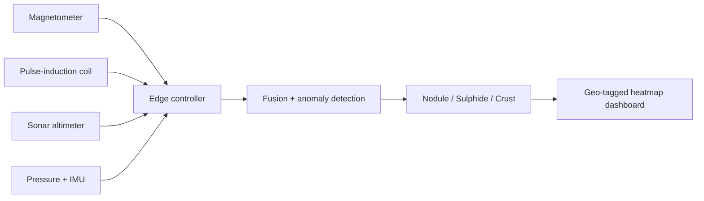

# 🌊 AquaMag Scout

**Low-cost, plug-and-play seafloor metal detection for ROV/AUV survey.**
Smart India Hackathon 2026 · SIH26064 · Team Bug Busters


## Why
Seabed survey sensors are heavy and expensive. AquaMag Scout fuses two
cheap sensing methods (magnetometer + pulse-induction coil), filters
noise on the edge, and flags metal-rich spots.

## How it works


## Try it (simulation)
```
pip install -r requirements.txt
cd simulation
python run_demo.py
```
On the demo seed it finds 4 of 4 synthetic targets and classifies 3 of 4
correctly (a wide "crust" is mistaken for a nodule).

## Honest status
- Simulation uses **synthetic, assumed** data, not real seabed readings.
- Classifier is rule-based, a placeholder for the planned TinyML model.
- Firmware is a sampling skeleton, not yet tested on hardware.

## Roadmap
- [x] Fusion + anomaly detection simulation
- [ ] Bench test with real sensors
- [ ] Pressure housing + data logger
- [ ] TinyML classifier
- [ ] Water-tank trial, then sea trial

See `docs/bom.md` for planned parts.